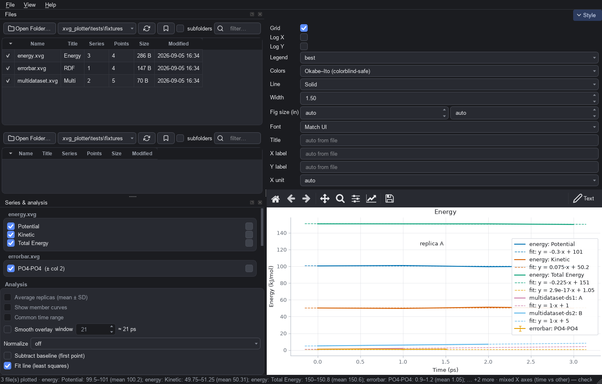
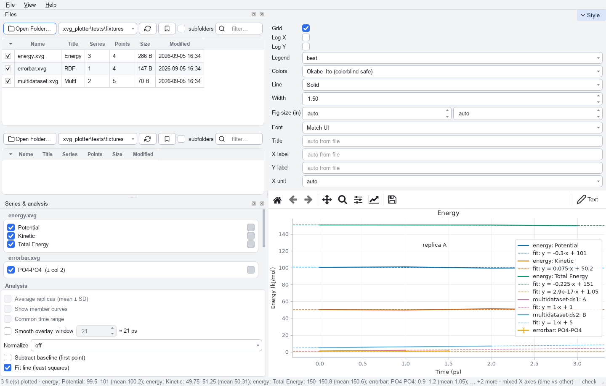
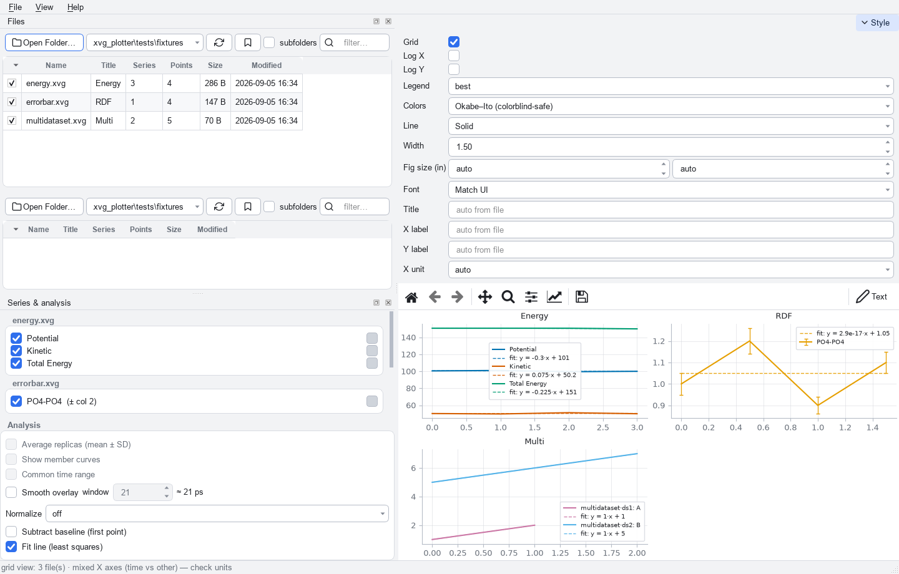

# XVG Plotter

<p align="center">
  
</p>

**Interactive cross-platform desktop viewer for GROMACS `.xvg` analysis files** — a modern
replacement for xmgrace, built with PySide6 + matplotlib.


<p align="center">
  <table>
    <tr>
      <td align="center"><br><sub><b>Dark</b> — multi-file overlay with fit line and annotation</sub></td>
      <td align="center"><br><sub><b>Light</b> — switch anytime from the View menu</sub></td>
    </tr>
  </table>
</p>

<p align="center">
  <br>
  <sub><b>Grid view</b> — one subplot per checked file (Ctrl+G)</sub>
</p>

## Why

MD simulation workflows produce hundreds of `.xvg` files. xmgrace is powerful but dated;
opening files one by one to eyeball convergence is slow. XVG Plotter scans a folder,
lists every file with its metadata, and gets you from *file* to *figure* in one click —
including overlays, replica averaging, and clipboard-ready exports for slides.

## Features

- **Browse** an analysis folder: every `.xvg` listed with title, series count, points, size,
  modified date — parsed from headers, problem files flagged in red with the reason.
- **Plot instantly**: click a file — title, axis labels and legend are pulled from the XVG header.
- **Compare**: checkbox several files to overlay them; select replicas and toggle
  **Average replicas** for a mean ± SD band (with faint member curves) and an optional
  **Common time range** so short replicas can't truncate long ones. Two stacked
  folder panes let you open two MD systems side by side and overlay files across
  folders (a status-bar warning flags mixed time/frame X axes).
- **Pin curves**: right-click a legend entry → *Pin curve* to keep it overlaid while
  you plot other files or open other folders — cross-folder comparison on one figure.
  View ▸ *Clear all pins* resets. A folder refresh re-reads pinned files' new data.
- **Annotate**: moving-average smoothing overlay (adjustable window, with a physical-time
  hint such as "≈ 2.1 ns"), ps → ns/µs/ms time-axis conversion with relabeling (guarded to
  real time axes), log axes, grid, legend placement, color palettes,
  line style/width, title and label overrides — all in a collapsible **Style** tab
  above the plot.
- **Interact**: pan, zoom, home, live cursor coordinates; click a legend entry to
  show/hide a series. Style tweaks keep your zoom, and switching files rescales
  the axes. Drag `.xvg` files or folders straight onto the window.
- **Session restore**: checked files, active file + dataset, hidden series,
  per-series colors, style and analysis settings, annotations and the canvas zoom
  are saved on close and restored on launch — yesterday's comparison comes back
  exactly as you left it.
- **Multi-dataset files**: every `&`-separated dataset of a file is listed with its
  own toggleable series; datasets overlay within a file and across files, and the
  CSV export follows the same view.
- **Annotate & derive**: click ✎ Text to place draggable text labels on the canvas
  (kept in exports/prints); Normalize (first value / max), Subtract baseline, and a
  dashed least-squares **Fit line** with its equation in the legend — all
  display-only, your files are never modified.
- **Grid view**: View ▸ *Grid view of checked files* (Ctrl+G) draws each checked
  file in its own subplot — an auto N×M small-multiples grid (up to 24 panels) —
  instead of an overlay; exports and prints output the whole grid.
- **Theme**: polished light & dark UI (Fusion). The plot canvas stays light
  (publication-style) in both themes, so figures read like paper figures.
  Auto (follows the OS) / Light / Dark, remembered between runs.
- **Export & output**: PNG/TIFF (DPI 100–600), PDF, SVG, EPS, transparent background —
  *Copy Image* at the export DPI, **Export all checked files** in one go, **Export data
  (CSV)** of the plotted numbers, and **Print** at the printer's resolution. Set an
  exact figure size (inches) and font family for journal specs; huge files draw with
  spike-preserving decimation and still export at full resolution.
- **Colors & legend**: colorblind-safe Okabe–Ito palette by default, per-series color
  swatches, and an outside-right legend that never covers data.
- **Keyboard & onboarding**: Ctrl+F filter, Ctrl+1/2/3 panels, Ctrl+G grid view,
  F11 focus mode, Ctrl+Shift+E batch export, Ctrl+D CSV export, Ctrl+P print —
  Help ▸ *Keyboard shortcuts* lists them all; Help ▸ *Reading the analyses*
  explains the jargon; a one-screen intro appears on first launch.
- **Native app**: own icon, single-instance (opening a second `.xvg` reuses the running
  window), pinnable recent folders, remembered window/export settings, manual
  *Check for updates*, settings export/import, live min/max/mean of plotted series.
  No command line required.

## Download

Grab `XVGPlotter.exe` from the [latest release](https://github.com/honeyk254/xvg-plotter/releases/latest)
— it's portable: double-click and run, no installer, no admin.

| OS | Status |
|---|---|
| Windows | ✅ portable exe + installer attached to releases |
| macOS | ✅ DMG (Apple Silicon) attached to releases — Intel Macs: build from source |
| Linux | ✅ x86_64 AppImage attached to releases |

macOS/Linux builds are produced by GitHub Actions on the target OS (PyInstaller
cannot cross-compile); for other architectures run `python packaging/build.py`
from source on that machine.

Double-clicking an `.xvg` file (where the association is registered) opens it directly in the app;
launching with a file argument plots it immediately.

### Verify your download

Every build writes `SHA256SUMS.txt` next to the artifacts. Compare before running:

```text
Windows (PowerShell):  certutil -hashfile XVGPlotter.exe SHA256
macOS / Linux:         shasum -a 256 <artifact>
```

### Security warnings are expected (unsigned build)

v1 is not code-signed (see [RELEASE.md](RELEASE.md) for IT/procurement guidance):

- **Windows**: SmartScreen may show "Windows protected your PC" → *More info* → *Run anyway*.
  Some antivirus products flag unsigned exes — verify the SHA-256 above first.
- **macOS**: first launch of the unsigned build → right-click → Open (Gatekeeper).
- **Linux**: `chmod +x` once, then run. On hosts without FUSE (cluster nodes, NFS homes)
  the AppImage automatically runs via `--appimage-extract-and-run`.

**File association**: the installer's `.xvg` checkbox is **off by default**, so an existing
grace install keeps handling `.xvg`. Tick it, or use Help ▸ *Set as default .xvg viewer*
(Windows) later — this only adds XVG Plotter as a choice and never removes another tool.

### Supported formats

GROMACS `.xvg` analysis output (RMSD, energy, RDF, Rg …). Trajectories (`.xtc`),
density maps (`.xpm`) and `.edr` files are **not** supported — this app is a viewer
for `.xvg` files only.

## Build from source

Requirements: Python ≥ 3.10. **Build inside a virtual environment** — PyInstaller
bundles the dependency graph of the interpreter it runs under, so a clean venv keeps
foreign global packages out of the binary:

```bash
python -m venv .venv
.venv/Scripts/pip install -e .[dev]     # Linux/macOS: .venv/bin/pip

# Windows (PyInstaller exe; adds an Inno Setup installer if ISCC.exe is installed)
python packaging/build.py              # portable exe + per-user installer
python packaging/build.py --onedir     # installer wraps a onedir build (fast cold start)
python packaging/build.py --machine    # per-machine installer variant (admin)

# macOS (app bundle + DMG) / Linux (AppImage)
python packaging/build.py
```

Artifacts land in `dist/`, with a `SHA256SUMS.txt` covering each build.
Icons are generated with `python assets/make_icons.py` (Pillow).

## Development

```bash
pip install -e .[dev]
python -m pytest tests/               # parser, analysis, and UI smoke tests
python -m xvg_plotter [folder-or-xvg] # run from source
```

Layout: `src/xvg_plotter/core/` (parser, models, analysis — pure Python, unit-tested, no Qt),
`src/xvg_plotter/ui/` (PySide6 widgets + matplotlib canvas, theme in `ui/theme.py`),
`packaging/` (per-OS build scripts).

## Project docs

- [PRD.md](PRD.md) — product requirements and scope
- [SPEC.md](SPEC.md) — technical specification
- [USER_PANEL.md](USER_PANEL.md) — simulated 30-person user panel
- [PROBLEM_LIST.md](PROBLEM_LIST.md) — consolidated pain points, mapped to v1 status
- [REMEDIATION_PLAN.md](REMEDIATION_PLAN.md) — phased fix plan (all 40 problems)
- [CHANGELOG.md](CHANGELOG.md) — release notes
- [RELEASE.md](RELEASE.md) — release & IT-deployment notes (checksums, silent install)

## Notes

- Handles GROMACS-style XVG: `@ title/xaxis/yaxis` headers, `@ sN legend`, error-bar files
  (`@ sN type xydy|xydx|xydxdy`), multi-dataset files (`&` separators), NaN/Inf values,
  CRLF and BOM. Unknown grace directives are ignored gracefully — their count is shown per
  file in the file list; malformed rows are skipped and reported per file — a bad file
  never crashes the app.
- "auto" time-unit conversion only rescales axes whose label identifies a time axis;
  a frame-index or other non-time X axis is left untouched (explicit unit picks still work).
- A rotating log (`xvg_plotter.log`) lives in the per-user app-data folder; unexpected
  errors show a dialog with copyable details and are written there.
- macOS builds are unsigned in v1 (right-click → Open on first launch).
